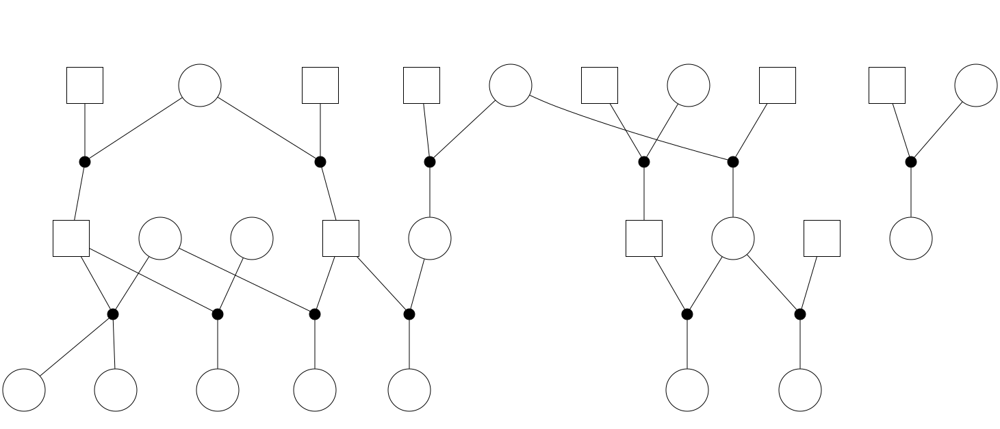
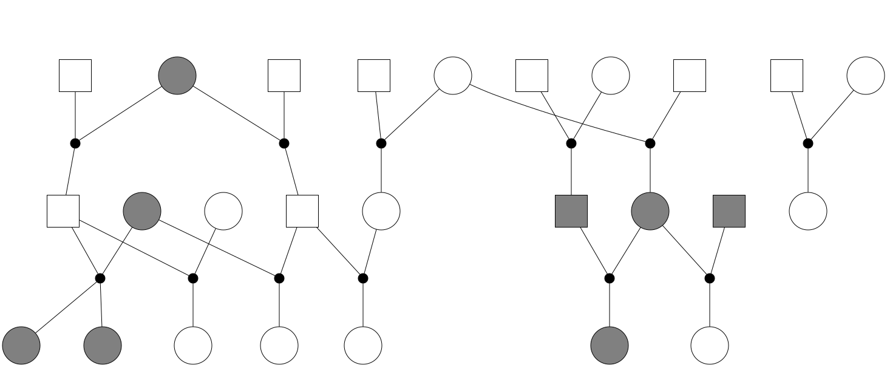
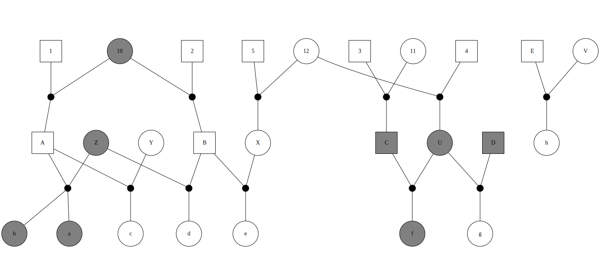
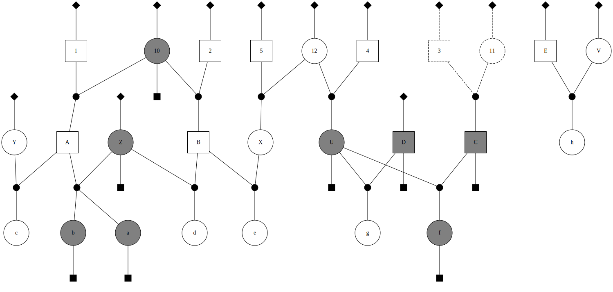

pedvis: an R package for drawing pedigrees
================
Eric C. Anderson

`pedvis` is a tiny package to take a data frame that lists a pedigree in
three columns (kid, pa, ma) and make a .dot file for a marriage node
diagram of the thing. It also will write it out as a pedigree factor
graph. And it will run dot on it if you have dot in your system path.

This is sort of a hairball at the moment, and I would do it all
differently if I had the time to do it over, but oh well. it works for
what I want to do at the moment.

The documentation isn’t complete, but I mostly want to get this thing up
on GitHub so Clemento, my homie at the lab, can draw some pedigrees.

## Preliminaries

1.  You should have `dot` from the `Graphviz` package installed. If not,
    get it from <http://www.graphviz.org/> for your system and install
    it and make sure that `dot` is in your PATH.

2.  You should have `epstodpdf` on your system. i.e. you ought to have
    ImageMagick or something of the sort. Thought this is probably not
    necessary if you are content to use the SVG output.

3.  The program will try to open a PDF file with a system call to the
    “open” command, which might be a Mac thing, and not portable. But
    you still should get SVG output.

## Getting the package and some examples.

The easiest way to get and install this package is with the devtools
package from within R:

``` r
remotes::install_github("eriqande/pedvis")
```

Then, if that was successful, here you can see what the input is all
about and do some examples

``` r
library(pedvis)  # load the package

# here is a simple input pedigree
simple_test_ped()
```

    ##    Kid Pa Ma
    ## 1    a  A  Z
    ## 2    b  A  Z
    ## 3    c  A  Y
    ## 4    d  B  Z
    ## 5    e  B  X
    ## 6    f  C  U
    ## 7    g  D  U
    ## 8    h  E  V
    ## 9    A  1 10
    ## 10   B  2 10
    ## 11   C  3 11
    ## 12   U  4 12
    ## 13   X  5 12

Note that the names of the individuals have to be *strings* NOT factors
or integers. So, use `stringsAsFactors = FALSE` if reading in a data
frame with `read.table`. (Or, better yet, use the `readr` package from
the `tidyverse`).

## Make a simple, faceless, nameless pedigree

Here we draw that simple pedigree as a marriage node diagram but we
don’t label anyone and we don’t shade anyone in as observed:

``` r
out1 <- ped2dot(
  simple_test_ped(), 
  outf = "ped2dot_ex1", 
  pfactorNodeStyle = "invis", 
  pfactorEdgeStyle = "invis"
)
```

Since the outfile name was `ped2dot_ex1`, this has created files in the
current working directory of:

``` sh
ped2dot_ex1.dot  # the dot input file
ped2dot_ex1.ps   # the Postscript file that dot produced (if you have
           # properly installed dot and it is in your system path)
ped2dot_ex1.svg  # an SVG file of the drawn pedigree
ped2dot_ex1.pdf  # if you have epstopdf on your system
```

We can create a folder to put `ped2dot_ex1.svg` into, and then display
it in the README:

``` r
dir.create("figures", showWarnings = FALSE)
dump <- file.copy("ped2dot_ex1.svg", "figures/", overwrite = TRUE)

```

<!-- -->

## Shade some of the individuals as having observed data

``` r
out2 <- ped2dot(
  simple_test_ped(), 
  ObsNodes = c("a", "b", "f", "C", "D", "Z", "U", "10"), 
  pfactorNodeStyle = "invis", 
  pfactorEdgeStyle = "invis",
  outf = "ped2dot_ex2"
)
```

Again, we insert it into this RMarkdown README like this:

``` r
dump <- file.copy("ped2dot_ex2.svg", "figures/", overwrite = TRUE)

```

<!-- -->

## Draw the same thing, but label the individuals

``` r
all_names <- unique(unlist(simple_test_ped()))
out3 <- ped2dot(
  simple_test_ped(), 
  ObsNodes = c("a", "b", "f", "C", "D", "Z", "U", "10"), 
  pfactorNodeStyle = "invis", 
  pfactorEdgeStyle = "invis",
  ShowLabelNodes = all_names,
  outf = "ped2dot_ex3"
)
```

Again, we insert it into this RMarkdown README like this:

``` r
dump <- file.copy("ped2dot_ex3.svg", "figures/", overwrite = TRUE)

```

<!-- -->

## Make a full blown pedigree factor graph

This is a pedigree factor graph in the sense of Anderson and Ng (2016).
In addition to the marriage nodes, it also explicitly shows \(p\)-nodes
(representing factors having to do with allele frequencies) and
\(g\)-nodes (representing factors having to do with genotypes of the
observed individuls). It also shows that you can designate some
individuals as “prongs,” which means they are hypothesized individuals.
They are drawn in as dashed, by default.

``` r
out4 <- ped2dot(
  simple_test_ped(), 
  ObsNodes = c("a", "b", "f", "C", "D", "Z", "U", "10"),
  outf = "ped2dot_ex4",
  ShowLabelNodes = all_names,
  Draw_O_factors = TRUE,
  ProngNodes = c("3", "11")
)
```

Again, we insert it into this RMarkdown README like this:

``` r
dump <- file.copy("ped2dot_ex4.svg", "figures/", overwrite = TRUE)

```

<!-- --> Note that to get the most out of
this package, in terms of customizing the pedigrees, it is good to know
the different possible edge and node attributes in `dot`, etc.

## Literature Cited

<div id="refs" class="references">

<div id="ref-anderson2016bayesian">

Anderson, Eric C, and Thomas C Ng. 2016. “Bayesian Pedigree Inference
with Small Numbers of Single Nucleotide Polymorphisms via a Factor-Graph
Representation.” *Theoretical Population Biology* 107: 39–51.

</div>

</div>
